# 课表图片识别系统开发文档 v2

版本：v2.0  
日期：2026-06-11  
状态：当前实现版  
仓库：https://github.com/Crazy-ChenMiLin/Table-backend

## 1. 项目概述

本项目实现一个课表图片识别 Web 应用。用户在前端页面上传 JPG/PNG 课表图片，后端将图片转为 Base64 Data URI，通过 LangChain4j 调用 OpenAI 兼容接口，由指定多模态模型识别课表内容，并返回结构化 JSON 数据。

当前版本包含：

- 纯前端三件套页面：`HTML + CSS + JavaScript`
- Spring Boot 后端接口
- LangChain4j 调用 OpenAI 兼容多模态模型
- 图片格式、大小校验
- 统一响应结构
- 统一异常处理
- 运行配置调试接口
- 环境变量读取 API Key，不提交真实密钥

当前版本不包含：

- 数据库写入
- 用户体系
- 任务队列
- 异步识别接口
- 历史记录
- 图片持久化存储

## 2. 核心业务流程

```mermaid
flowchart LR
    A["用户选择课表图片"] --> B["前端校验 JPG/PNG 与 5MB"]
    B --> C["POST multipart/form-data"]
    C --> D["后端校验图片"]
    D --> E["图片转 Base64 Data URI"]
    E --> F["构造 LangChain4j 多模态消息"]
    F --> G["调用 OpenAI 兼容多模态模型"]
    G --> H["清洗 AI 返回 JSON"]
    H --> I["反序列化为 ScheduleResponse"]
    I --> J["返回统一 Result JSON"]
    J --> K["前端渲染课程表格与 JSON"]
```



## 3. 技术栈

| 模块 | 技术 | 当前版本/说明 |
| --- | --- | --- |
| 后端框架 | Spring Boot | 4.0.6 |
| JDK | Java | 21 |
| 构建工具 | Maven Wrapper | 使用 `mvnw.cmd` |
| Web | Spring Boot Starter Web | 静态资源 + REST API |
| AI 调用 | LangChain4j | 0.36.0 |
| OpenAI 兼容客户端 | `langchain4j-open-ai` | 调用兼容接口 |
| JSON | Jackson | Spring Boot 内置 |
| 前端 | HTML/CSS/JS | 不引入打包工具 |
| 模型 | 默认模型 | `mimo-v2.5` |

## 4. 项目结构

```text
demo1
├── pom.xml
├── mvnw
├── mvnw.cmd
├── src
│   ├── main
│   │   ├── java/org/example/demo1
│   │   │   ├── Demo1Application.java
│   │   │   ├── config
│   │   │   │   ├── AppConfig.java
│   │   │   │   └── MimoProperties.java
│   │   │   ├── controller
│   │   │   │   └── ScheduleAIController.java
│   │   │   ├── exception
│   │   │   │   ├── BusinessException.java
│   │   │   │   └── GlobalExceptionHandler.java
│   │   │   ├── model/dto
│   │   │   │   ├── CourseInfo.java
│   │   │   │   ├── Result.java
│   │   │   │   └── ScheduleResponse.java
│   │   │   ├── service
│   │   │   │   ├── ScheduleAIService.java
│   │   │   │   └── impl/ScheduleAIServiceImpl.java
│   │   │   └── util
│   │   │       └── Base64Util.java
│   │   └── resources
│   │       ├── application.properties
│   │       └── static
│   │           ├── index.html
│   │           ├── style.css
│   │           └── app.js
│   └── test/java/org/example/demo1
│       └── Demo1ApplicationTests.java
└── 课表开发文档v2.md
```

## 5. 模块职责

| 模块 | 职责 |
| --- | --- |
| `Demo1Application` | Spring Boot 启动入口 |
| `AppConfig` | 注册 Jackson `ObjectMapper`，启用 `MimoProperties` 配置绑定 |
| `MimoProperties` | 读取并保存 Mimo API 配置 |
| `ScheduleAIController` | 暴露识别接口与配置调试接口 |
| `ScheduleAIService` | 定义课表识别业务接口 |
| `ScheduleAIServiceImpl` | 图片校验、Base64 编码、LangChain4j 调用、JSON 清洗解析 |
| `BusinessException` | 业务异常，携带响应码 |
| `GlobalExceptionHandler` | 统一捕获异常并返回 `Result` |
| `Result` | 全局统一响应结构 |
| `ScheduleResponse` | AI 识别结果结构 |
| `CourseInfo` | 单门课程结构 |
| `Base64Util` | 图片字节数组转 Data URI |
| `static/index.html` | 上传与结果展示页面 |
| `static/style.css` | 页面样式 |
| `static/app.js` | 前端校验、上传、结果渲染 |

## 6. 配置说明

配置分为两层：

- 项目内配置：`src/main/resources/application.properties`
- 运行时配置：项目根目录 `.env`，通过 IDE EnvFile 或系统环境变量注入

配置文件：`src/main/resources/application.properties`

```properties
spring.application.name=demo1
server.port=8080

spring.servlet.multipart.max-file-size=5MB
spring.servlet.multipart.max-request-size=5MB

mimo.base-url=${AI_BASE_URL:https://token-plan-cn.xiaomimimo.com/v1}
mimo.api-key=${AI_API_KEY:}
mimo.model=${AI_MODEL:mimo-v2.5}
mimo.temperature=${AI_TEMPERATURE:0.0}
mimo.timeout-seconds=${AI_TIMEOUT_SECONDS:180}
mimo.max-retries=${AI_MAX_RETRIES:1}
mimo.max-image-size-mb=${AI_MAX_IMAGE_SIZE_MB:5}
```

### 6.1 环境变量

推荐把运行时变量统一放到项目根目录 `.env` 中，由 IDE EnvFile 读取。

示例：

```env
AI_API_KEY=your-api-key-here
AI_BASE_URL=https://token-plan-cn.xiaomimimo.com/v1
AI_MODEL=mimo-v2.5
AI_TEMPERATURE=0.0
AI_TIMEOUT_SECONDS=180
AI_MAX_RETRIES=1
AI_MAX_IMAGE_SIZE_MB=5
```

仓库中提供模板文件：

- `.env.example`

必须配置：

| 变量 | 说明 |
| --- | --- |
| `AI_API_KEY` | AI 服务 API Key |

可选配置：

| 变量 | 默认值 | 说明 |
| --- | --- | --- |
| `AI_BASE_URL` | `https://token-plan-cn.xiaomimimo.com/v1` | OpenAI 兼容接口地址 |
| `AI_MODEL` | `mimo-v2.5` | 识别使用的模型名 |
| `AI_TEMPERATURE` | `0.0` | 模型温度 |
| `AI_TIMEOUT_SECONDS` | `180` | AI 调用超时时间 |
| `AI_MAX_RETRIES` | `1` | LangChain4j 最大重试次数 |
| `AI_MAX_IMAGE_SIZE_MB` | `5` | 后端图片大小限制 |

注意：当前默认模型是 `mimo-v2.5`。如果在 `.env` 或 IDE 运行配置中显式设置 `AI_MODEL`，项目会优先读取该值。代码中对旧值 `mimo-v1` 做了防护，避免旧运行配置导致接口报 `Not supported model mimo-v1`。

### 6.2 密钥安全

真实 API Key 不应提交到仓库。`.gitignore` 已忽略：

```text
.env
.env.local
.env.*.local
```

本地可使用 `.env` 或 IDE 运行配置保存 `AI_API_KEY`。真实 `.env` 不应提交，仓库中应只提交 `.env.example`。

## 7. API 接口

### 7.1 课表图片识别

接口：

```http
POST /api/ai/schedule/recognize
Content-Type: multipart/form-data
```

请求参数：

| 参数 | 类型 | 必填 | 说明 |
| --- | --- | --- | --- |
| `image` | file | 是 | JPG/PNG 图片，最大 5MB |

成功响应：

```json
{
  "code": 200,
  "message": "操作成功",
  "data": {
    "semester": "2025-2026学年第二学期",
    "week": "第1-16周",
    "courses": [
      {
        "courseName": "高等数学",
        "dayOfWeek": "1",
        "startSection": "1",
        "endSection": "2",
        "location": "教学楼A101",
        "teacher": "张老师",
        "weekRange": "1-16周"
      }
    ]
  }
}
```

错误响应：

```json
{
  "code": 400,
  "message": "仅支持JPG、PNG格式的图片",
  "data": null
}
```

常见错误：

| code | message 示例 | 原因 |
| --- | --- | --- |
| 400 | `图片文件不能为空` | 未上传图片或空文件 |
| 400 | `仅支持JPG、PNG格式的图片` | 文件类型不符合要求 |
| 400 | `图片大小不能超过5MB` | 图片超过限制 |
| 500 | `未配置 AI_API_KEY 环境变量` | 后端运行环境未设置 API Key |
| 500 | `AI识别超时，请稍后重试...` | 上游 AI 服务响应超过超时时间 |
| 500 | `AI返回结果不是有效的JSON格式` | 模型返回内容无法解析为指定 JSON |

### 7.2 当前 AI 配置检查

接口：

```http
GET /api/ai/schedule/config
```

用途：调试当前运行中的后端是否加载了正确模型与环境变量，不返回真实 API Key。

响应示例：

```json
{
  "code": 200,
  "message": "操作成功",
  "data": {
    "baseUrl": "https://token-plan-cn.xiaomimimo.com/v1",
    "model": "mimo-v2.5",
    "apiKeyConfigured": true,
    "timeoutSeconds": 180,
    "maxRetries": 1
  }
}
```

## 8. 数据结构

### 8.1 Result

```json
{
  "code": 200,
  "message": "操作成功",
  "data": {}
}
```

字段说明：

| 字段 | 类型 | 说明 |
| --- | --- | --- |
| `code` | number | 业务响应码 |
| `message` | string | 响应说明 |
| `data` | object/null | 响应数据 |

### 8.2 ScheduleResponse

| 字段 | 类型 | 说明 |
| --- | --- | --- |
| `semester` | string | 学期，无法识别时为 `未知` |
| `week` | string | 教学周范围，无法识别时为 `未知` |
| `courses` | array | 课程数组 |

### 8.3 CourseInfo

| 字段 | 类型 | 说明 |
| --- | --- | --- |
| `courseName` | string | 课程名称 |
| `dayOfWeek` | string | 星期，`1-7`，`1=周一` |
| `startSection` | string | 开始节次 |
| `endSection` | string | 结束节次 |
| `location` | string | 上课地点 |
| `teacher` | string | 授课教师 |
| `weekRange` | string | 开课周次 |

## 9. AI 提示词策略

后端在 `ScheduleAIServiceImpl` 中构造两类消息：

- `SystemMessage`：定义课表识别角色、JSON 输出结构、字段约束。
- `UserMessage`：携带图片 Data URI，通过 `ImageContent.from(...)` 传给多模态模型。

核心约束：

- 只输出纯 JSON。
- 不允许输出 Markdown 代码块。
- 所有字段按字符串处理。
- 学期、地点、教师无法识别时填 `未知`。
- 星期与节次必须存在。
- 课程按星期和开始节次升序排列。

后端仍会做 JSON 清洗：

- 去掉可能出现的 ```json 代码块标记。
- 截取第一个 `{` 到最后一个 `}`。
- 使用 Jackson 反序列化为 `ScheduleResponse`。

## 10. 前端功能

页面入口：

```text
http://localhost:8080/
```

静态文件：

```text
src/main/resources/static/index.html
src/main/resources/static/style.css
src/main/resources/static/app.js
```

功能：

- 选择图片
- 拖拽上传图片
- 图片预览
- JPG/PNG 校验
- 5MB 大小校验
- 调用后端识别接口
- 显示加载状态
- 显示错误信息
- 展示学期、周次、课程数
- 展示课程表格
- 展示 JSON 原文

前端上传逻辑：

```javascript
const formData = new FormData();
formData.append("image", selectedFile);

fetch("/api/ai/schedule/recognize", {
    method: "POST",
    body: formData
});
```

前端不传模型名。模型选择完全由后端配置决定。

## 11. 运行方式

### 11.1 环境准备

要求：

- JDK 21
- Maven Wrapper
- 可访问目标 AI 服务的 OpenAI 兼容接口
- 已配置 `AI_API_KEY`

### 11.2 Windows PowerShell 启动示例

```powershell
$env:JAVA_HOME="C:\Users\26487\.jdks\ms-21.0.10"
$env:PATH="$env:JAVA_HOME\bin;$env:PATH"
$env:AI_API_KEY="你的 API Key"
.\mvnw.cmd spring-boot:run
```

启动后访问：

```text
http://localhost:8080/
```

### 11.3 IDEA 启动配置

推荐做法：

- 安装并启用 EnvFile 插件
- 在运行配置里勾选 EnvFile
- 指向项目根目录的 `.env`

如果不用 EnvFile，也可以手动填写环境变量。

运行配置中至少需要：

```text
AI_API_KEY=你的 API Key
AI_BASE_URL=https://token-plan-cn.xiaomimimo.com/v1
AI_MODEL=mimo-v2.5
```

推荐直接使用 `.env`，避免 IDEA、命令行和文档中的配置不一致。

## 12. 测试

### 12.1 自动测试

```powershell
.\mvnw.cmd test
```

当前测试：

- Spring Boot 上下文能正常加载。
- 静态首页能作为 welcome page 注册。
- 未配置 API Key 时项目仍可启动。

### 12.2 手动测试

配置检查：

```powershell
curl http://localhost:8080/api/ai/schedule/config
```

图片识别：

```powershell
curl -X POST -F "image=@C:\Users\26487\Downloads\AI.png;type=image/png" http://localhost:8080/api/ai/schedule/recognize
```

预期：

- 未配置 `AI_API_KEY`：返回 `未配置 AI_API_KEY 环境变量`。
- 已配置 `AI_API_KEY`：请求发送给上游 AI 服务，成功时返回课程 JSON。
- 图片过大、格式不对或空文件：返回 400 业务错误。

## 13. 已知问题与处理

### 13.1 AI 调用超时

现象：

```text
java.io.InterruptedIOException: timeout
```

原因：

- 图片较大，转 Base64 后请求体更大。
- 多模态识别耗时较长。
- 网络或上游 AI 服务响应较慢。

当前处理：

- 默认超时已提高到 180 秒。
- 默认最大重试次数降为 1。
- 超时时返回友好错误：`AI识别超时，请稍后重试，或换一张更清晰、文件更小的课表图片`。

后续优化：

- 增加前端图片压缩。
- 增加异步识别接口。
- 增加任务状态轮询。
- 增加服务端图片尺寸压缩。

### 13.2 旧模型名 `mimo-v1`

现象：

```text
Not supported model mimo-v1
```

原因：

- 旧环境变量或旧 IDEA 运行配置中设置过 `AI_MODEL=mimo-v1`。
- 旧进程未重启。

当前处理：

- 配置文件默认使用 `mimo-v2.5`。
- `MimoProperties` 中如果读到 `mimo-v1` 会自动替换为 `mimo-v2.5`。
- 可访问 `/api/ai/schedule/config` 检查运行中实际模型。

### 13.3 后端同步调用

当前识别接口是同步接口：浏览器发起请求后等待 AI 返回结果。

这不是当前超时异常的根因。前端 `fetch` 是异步的，后端同步等待 AI 结果在简单版本中可接受。

如果后续识别时间经常超过 180 秒，建议升级为异步任务：

- `POST /api/ai/schedule/tasks` 创建识别任务。
- `GET /api/ai/schedule/tasks/{taskId}` 查询任务状态。
- 任务状态包括 `PENDING`、`RUNNING`、`SUCCESS`、`FAILED`。

## 14. Git 与部署注意事项

已推送到 GitHub：

```text
https://github.com/Crazy-ChenMiLin/Table-backend.git
```

不要提交：

- `.env`
- API Key
- `target/`
- IDE 私有配置

推荐部署命令：

```powershell
.\mvnw.cmd clean package
java -jar target\demo1-0.0.1-SNAPSHOT.jar
```

部署环境必须设置：

```text
AI_API_KEY
```

## 15. v2 相比 v1 的变化

- 新增可用前端页面。
- 后端改为实际 Spring Boot Web 应用。
- 接入 LangChain4j `OpenAiChatModel`。
- 模型固定为 `mimo-v2.5`。
- API Key 改为环境变量读取。
- 新增配置检查接口。
- 新增统一异常处理。
- 新增 JSON 清洗逻辑。
- 新增超时识别与友好错误提示。
- 去除数据库依赖，当前不启用 ORM。
- 增加 `.env` 忽略规则，避免密钥提交。

## 16. 后续迭代建议

优先级从高到低：

1. 前端图片压缩，减少 Base64 请求体大小。
2. 增加异步识别任务接口，避免长时间 HTTP 等待。
3. 增加 Mock AI 测试，覆盖 JSON 清洗与解析。
4. 增加课程人工修正页面。
5. 增加数据库持久化。
6. 增加批量识别。
7. 增加用户体系与权限控制。
